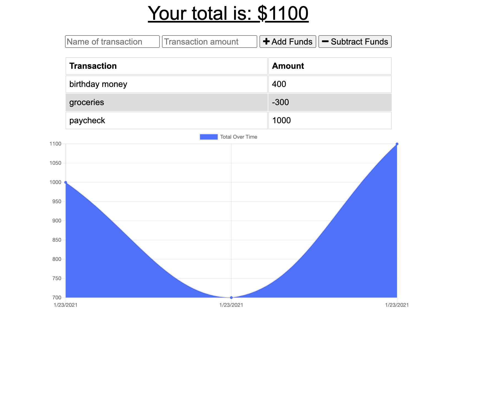

# Week-18-Budget-Tracker-
Offline Budget Tracker 
## Description 

Keep track of your mony anware you got.  No need for internet to know your finances.  With this app you can use it anwhere.  In this project the provided app is fully punctional in an online state.  When the user is not connected to the internet the app is able to track and save user input data and update the app once back online.  

## Technologies 

MongoDB, MongoDB Atlas, Heroku, Github, Javascript, CSS, HTML, NPM 

## Images 

## Links

* Link to 
[GitHub](https://github.com/rffrye/Week-18-Budget-Tracker)

* Link to deployed 
[app](https://budgettrackerrf.herokuapp.com/)

